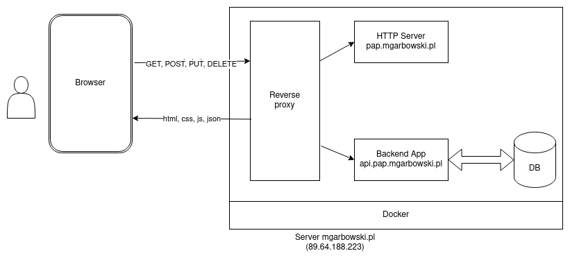

# Architektura aplikacji

## Serwer

Szczegóły dostępne na stronie [server](./server.md)

## Architektura



Aplikacja składa się z komponentów

* Reverse proxy
* Serwer HTTP - serwujący aplikację frontendową
* Aplikacja Spring Boot
* Baza danych - PostgreSQL

### Komunikacja sieciowa

Każdy z komponentów jest uruchomiony w oddzielnym kontenerze Dockera.
Wszystkie znajdują się w jednej sieci (docker network), w związku z tym, w komunikacji sieciowej między kontenerami
można używać nazw kontenerów jako nazw domenowych, ponieważ kontenery używają wewnętrznego DNS Dockera.
Tzn. zapytanie `http://pap-backend/` wysłane przez reverse proxy zostanie odebrane przez kontener `pap-backend`.

Komunikacja między kontenerami używa protokołu HTTP - nie musi być szyfrowana, ponieważ jest wewnętrzna dla serwera.

### Reverse Proxy

Ze względu na to, że ten sam serwer obsługuje również inne subdomeny, wykorzystujemy reverse proxy (Nginx).

Jedna instancja Nginx obsługuje zapytania HTTP i HTTPS ze świata zewnętrznego i jeśli dotyczą subdomen
`pap.mgarbowski.pl` lub `api.pap.mgarbowski.pl` przekazuje zapytania do odpowiednich kontenerów.

Nginx obsługuje komunikację HTTPS, zapytania klientów do subdomen `mgarbowski.pl` są szyfrowane. Zapytania HTTP
(port 80) są automatycznie przekierowywane na port 443 (HTTPS).

Używamy certyfikatów wystawionych przez [Let's Encrypt](https://letsencrypt.org/). Za pozyskiwanie i okresowe
odświeżanie certyfikatów odpowiada program [certbot](https://certbot.eff.org/)

### Proxy pass

Dla poprawnego generowania linków przez Spring HATEOAS trzeba ustawić odpowiednie nagłówki przy przekierowywaniu
zapytań przez reverse proxy do serwera aplikacyjnego. Spring z ustawionym parametrem
`server.forward-headers-strategy: framework` buduje link na podstawie nagłówków (tak że linki zaczynają się od
`http://api.pap.mgarbowski.pl` a nie od `http://pap-backend:8080`)

Konfiguracja Nginx

```
server {
        server_name api.pap.mgarbowski.pl;
        
        location / {
                proxy_pass http://pap-backend:8080/;
                proxy_set_header Host $host;
                proxy_set_header X-Real-IP $remote_addr;
                proxy_set_header X-Forwarded-For $proxy_add_x_forwarded_for;
                proxy_set_header X-Forwarded-Proto $scheme;
        }
    ...
}
```

### Serwer HTTP

Kolejna instancja Nginx serwująca statyczne pliki aplikacji frontendowej - aplikacja React spakowana do jednego
pliku `.js`.

### Aplikacja Spring Boot

REST API przyjmuje zapytania i zwraca odpowiedzi w formacie JSON, komunikuje się z bazą danych

### Baza danych

Relacyjna baza danych PostgreSQL. Dane są nieulotne, przechowywane w Docker Volume w katalogu `/srv/pap/.data`
